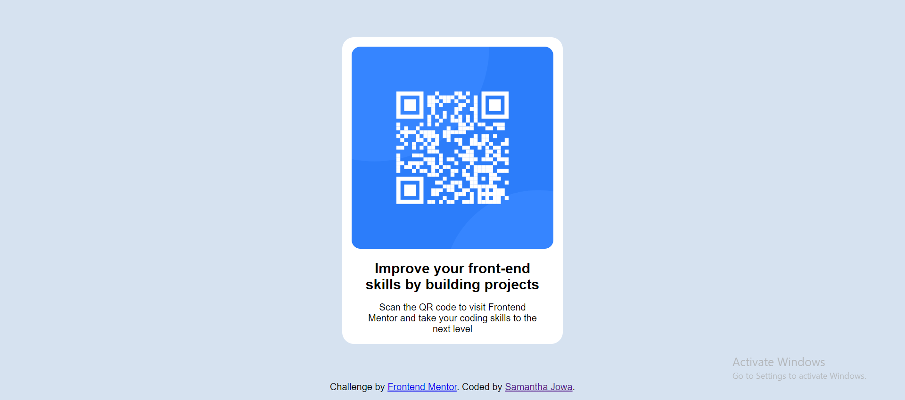

# Frontend Mentor - QR code component solution

This is a solution to the [QR code component challenge on Frontend Mentor](https://www.frontendmentor.io/challenges/qr-code-component-iux_sIO_H). Frontend Mentor challenges help you improve your coding skills by building realistic projects. 

## Table of contents

- [Overview](#overview)
  - [Screenshot]()
  - [Links](#links)
- [My process](#my-process)
  - [Built with](#built-with)
- [Author](#author)
- [Acknowledgments](#acknowledgments)

## Overview

### Screenshot

### Links

- Solution URL: [Add solution URL here](https://your-solution-url.com)
- Live Site URL: [Add live site URL here](https://your-live-site-url.com)

## My process

### Built with

- Semantic HTML5 
- CSS 

## Author

- Frontend Mentor - [@SamanthaJowa](https://www.frontendmentor.io/profile/SamanthaJowa)
- Twitter - [@samanthajowa_](https://www.twitter.com/samanthajowa_)

## Acknowledgments

Credits to Web Coach on YouTube. His solution helped me when I got stuck
